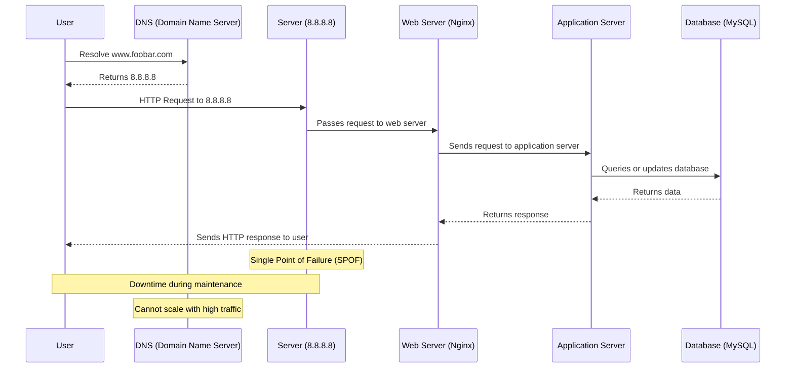
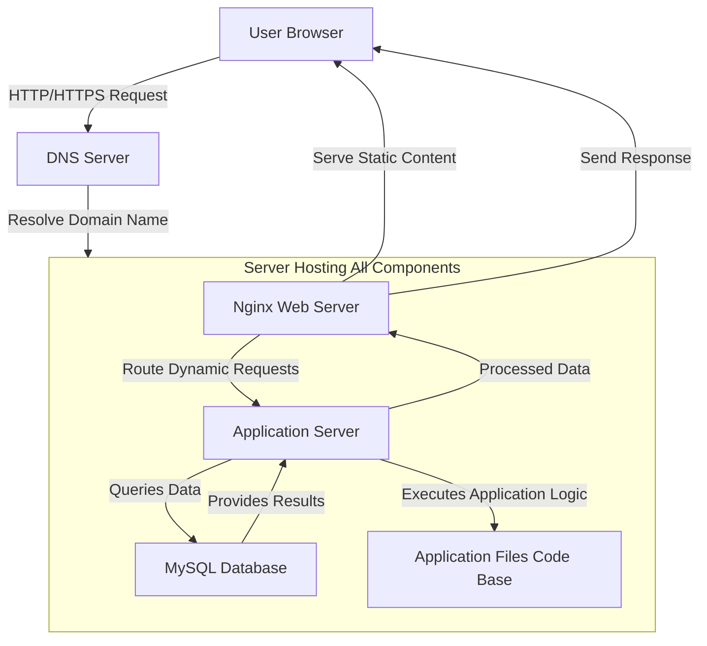
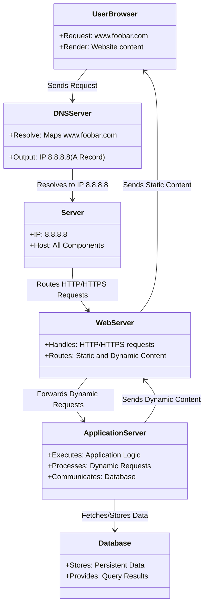

### Simple Web Infrastructure Design for www.foobar.com

#### Infrastructure Overview
We will design a one-server infrastructure for the website `www.foobar.com` with the following components:

1. **Server**: A single machine running all necessary services.
2. **Web Server (Nginx)**: Handles HTTP/HTTPS requests.
3. **Application Server**: Processes dynamic content requests by executing code.
4. **Application Files**: The codebase for the website.
5. **Database (MySQL)**: Stores and retrieves data for the website.
6. **Domain Name**: `foobar.com` with a `www` subdomain pointing to `8.8.8.8`.

#### User Interaction Flow
1. A user opens their browser and types `www.foobar.com`.
2. The browser queries a **DNS server** to resolve `www.foobar.com` to the IP address `8.8.8.8`.
3. The browser sends an HTTP/HTTPS request to the server at `8.8.8.8`.
4. The **Nginx web server** receives the request and forwards it to the application server.
5. The **application server** executes the necessary code, queries the **MySQL database** if needed, and generates a response.
6. The **web server** sends the response back to the user’s browser, rendering the website.

#### Infrastructure Components

1. **Server**
   - A physical or virtual machine with an IP address `8.8.8.8`.
   - Runs the web server, application server, database, and other required services.

2. **Domain Name**
   - `foobar.com` is the human-readable address of the website.
   - The `www` subdomain is configured with an **A record** pointing to `8.8.8.8`.

3. **DNS Record**
   - The `www` record is an **A record** that maps `www.foobar.com` to the server’s IP address `8.8.8.8`.

4. **Web Server (Nginx)**
   - Listens for incoming HTTP/HTTPS requests on port 80/443.
   - Routes static files (e.g., images, CSS, JS) directly to the user’s browser.
   - Passes dynamic requests to the application server.

5. **Application Server**
   - Processes dynamic requests using the application files (e.g., Python Flask, PHP, Node.js).
   - Communicates with the database to retrieve or store data.

6. **Application Files**
   - The website’s codebase containing logic, templates, and static assets.

7. **Database (MySQL)**
   - Stores data such as user information, website content, and application settings.
   - Responds to queries from the application server.

#### Communication
- **Protocol**: The server communicates with the user’s browser using HTTP/HTTPS.
- **Ports**:
  - HTTP: 80
  - HTTPS: 443
  - MySQL: 3306 (for internal use by the application server).

#### Infrastructure Issues
1. **Single Point of Failure (SPOF)**
   - If the server goes down, the entire website becomes inaccessible.

2. **Downtime During Maintenance**
   - Updating the web server or deploying new code requires restarting services, causing temporary unavailability.

3. **Limited Scalability**
   - A single server cannot handle high traffic loads or distribute requests across multiple machines.

#### Visual Representation (Detailed Schema)
```plaintext
+----------------------------+
|        User Browser        |  <--- User initiates a request by typing www.foobar.com in their browser.
+----------------------------+
                |
                V
+----------------------------+
|        DNS Server          |  <--- Resolves the domain name (www.foobar.com) to the server’s IP (8.8.8.8).
| Resolves www.foobar.com    |
| to IP 8.8.8.8 (A Record)   |
+----------------------------+
                |
                V
+----------------------------+
|         Server             |  <--- Central machine hosting all components of the website.
| IP: 8.8.8.8               |
| +------------------------+ |
| |    Web Server (Nginx)   |  <--- Handles HTTP/HTTPS requests and serves static content.
| +------------------------+ |
|         | Application Server |  <--- Executes application logic and processes dynamic requests.
|         +---------------------+
|                | Database (MySQL)|  <--- Stores and retrieves data needed by the application.
|                +------------------+
+----------------------------+
```

[task0](task0ds.mmd)




[task0](task0v2.mmd)




    %% Additional Descriptions
    Note over User, DNS: User sends a request to www.foobar.com
    Note over DNS, MainServer: DNS resolves the domain name to IP 8.8.8.8
    Note over WebServer, AppServer: Nginx serves static content and routes dynamic requests
    Note over Database: MySQL stores and retrieves persistent data
    Note over MainServer: Single server hosts all components


[task0](task0.mmd)




```plaintext
Explanation concept:
- **User Browser**: Sends requests and renders responses.
- **DNS Server**: Maps domain names to IP addresses
- **Web Server**: Directs static and dynamic requests appropriately.
- **Application Server**: Processes code and interacts with the database.
- **Database**: Provides persistent storage and retrieval of data.

# Relation and interaction:
- UserBrowser --> DNSServer : Sends Request
- DNSServer --> Server : Resolves to IP 8.8.8.8
- Server --> WebServer : Routes HTTP/HTTPS Requests
- WebServer --> ApplicationServer : Forwards Dynamic Requests
- ApplicationServer --> Database : Fetches/Stores Data
- WebServer --> UserBrowser : Sends Static Content
- ApplicationServer --> WebServer : Sends Dynamic Content
```

```plaintext
classDiagram
    class UserBrowser {
        +Request: www.foobar.com
        +Render: Website content
    }

    class DNSServer {
        +Resolve: Maps www.foobar.com
        +Output: IP 8.8.8.8 (A Record)
    }

    class Server {
        +IP: 8.8.8.8
        +Host: All Components
    }

    class WebServer {
        +Handles: HTTP/HTTPS requests
        +Routes: Static and Dynamic Content
    }

    class ApplicationServer {
        +Executes: Application Logic
        +Processes: Dynamic Requests
        +Communicates: Database
    }

    class Database {
        +Stores: Persistent Data
        +Provides: Query Results
    }

    UserBrowser --> DNSServer : Sends Request
    DNSServer --> Server : Resolves to IP 8.8.8.8
    Server --> WebServer : Routes HTTP/HTTPS Requests
    WebServer --> ApplicationServer : Forwards Dynamic Requests
    ApplicationServer --> Database : Fetches/Stores Data
    WebServer --> UserBrowser : Sends Static Content
    ApplicationServer --> WebServer : Sends Dynamic Content

```


#### Repository
- **GitHub Repository**: `holbertonschool-system_engineering-devops`
- **Directory**: `web_infrastructure_design`
- **File**: `0-simple_web_stack`
