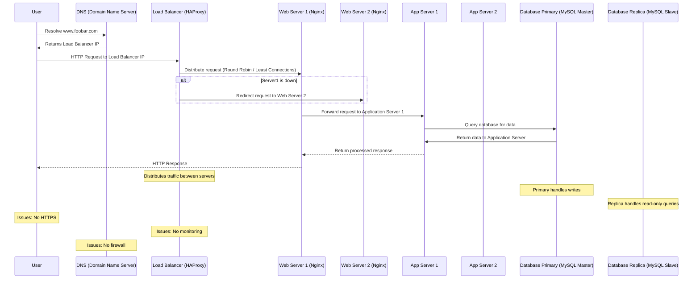
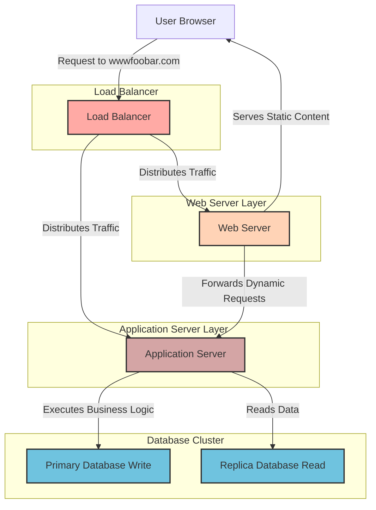

### Distributed Web Infrastructure for www.foobar.com

#### Infrastructure Overview
We are designing a distributed web infrastructure that improves scalability, availability, and reliability for hosting the website www.foobar.com. This architecture includes:

1. **3 Servers:** Two for application hosting and one for database management.
2. **1 Load Balancer (HAProxy):** Distributes traffic between the web servers.
3. **1 Web Server (Nginx):** Handles static content and forwards dynamic requests.
4. **1 Application Server:** Processes application logic and queries the database.
5. **1 Database (MySQL):** Configured as a Primary-Replica cluster for redundancy.

---

### Key Components and Their Roles

1. **Load Balancer (HAProxy):**
   - **Purpose:** Distributes incoming traffic among web servers.
   - **Algorithm:** Configured with a **Round Robin** algorithm to evenly distribute traffic across the servers. This ensures each server handles an equal share of requests.
   - **Active-Active Setup:** Both web servers are operational and serve requests simultaneously.
     - **Active-Active vs. Active-Passive:**
       - In Active-Active, all servers actively serve traffic.
       - In Active-Passive, one server is on standby and only takes over if the active server fails.

2. **Web Server (Nginx):**
   - **Purpose:**
     - Handles static files (e.g., HTML, CSS, JavaScript).
     - Forwards dynamic requests to the application server.

3. **Application Server:**
   - **Purpose:** Executes the application logic using the codebase.
   - Communicates with the database to fetch or store data.

4. **Database (MySQL):**
   - Configured as a **Primary-Replica (Master-Slave)** cluster:
     - **Primary Node:** Handles write requests.
     - **Replica Node:** Handles read requests and syncs data from the primary node.
     - **How it Works:** The replica constantly replicates the primary node’s data, ensuring data redundancy and improving performance by offloading read queries.
   - **Differences Between Primary and Replica Nodes:**
     - **Primary Node:** Processes all data modifications (INSERT, UPDATE, DELETE).
     - **Replica Node:** Processes only read queries and keeps a synchronized copy of the data from the primary node.

---

### Benefits of Each Element

1. **Load Balancer:**
   - **Why:** Prevents overloading a single server, ensuring traffic distribution.
   - **Scalability:** New servers can be added easily to the pool.

2. **Web Server:**
   - **Why:** Separates static content delivery from dynamic content processing, improving performance.

3. **Application Server:**
   - **Why:** Processes dynamic requests and isolates the business logic layer.

4. **Database Cluster:**
   - **Why:**
     - Redundancy: Ensures high availability and fault tolerance.
     - Performance: Offloads read queries to the replica node, reducing the load on the primary node.

---

### Issues with This Infrastructure

1. **Single Points of Failure (SPOF):**
   - The load balancer is a SPOF. If it fails, the entire system becomes inaccessible.
   - The primary database node is a SPOF. If it fails, write operations are disrupted.

2. **Security Issues:**
   - No firewall to protect against unauthorized access.
   - No HTTPS to encrypt traffic, leaving data vulnerable to interception.

3. **No Monitoring:**
   - Lack of a monitoring system makes it difficult to detect and respond to failures or performance issues.

---

### Improvements to Address Issues

1. **Redundant Load Balancer:**
   - Deploy a secondary load balancer with failover mechanisms to eliminate the SPOF.

2. **Database Failover:**
   - Implement automated failover for the primary database node to promote a replica node if the primary fails.

3. **Security Enhancements:**
   - Add a firewall to restrict unauthorized traffic.
   - Enable HTTPS by configuring SSL/TLS certificates.

4. **Monitoring Tools:**
   - Use monitoring tools like **Prometheus** or **Nagios** to track server health, traffic patterns, and resource utilization.

---

### Final Diagram of the Distributed Web Infrastructure

#### Components:
1. **Load Balancer (HAProxy):** Handles traffic distribution.
2. **Web Servers (Nginx):** Serve static files and forward dynamic requests.
3. **Application Servers:** Process dynamic requests.
4. **Database Cluster (MySQL):** Provides redundancy with Primary and Replica nodes.

---

### Repository
- **GitHub Repository:** `holbertonschool-system_engineering-devops`
- **Directory:** `web_infrastructure_design`
- **File:** `1-distributed_web_infrastructure`

[task1](task1dg.mmd)

[task1](task1.mmd)

