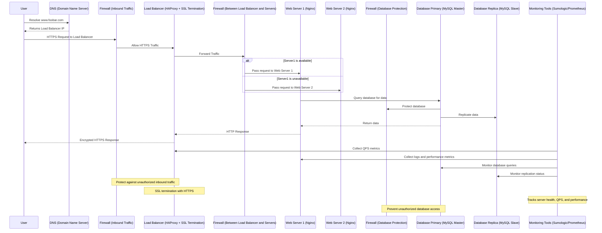
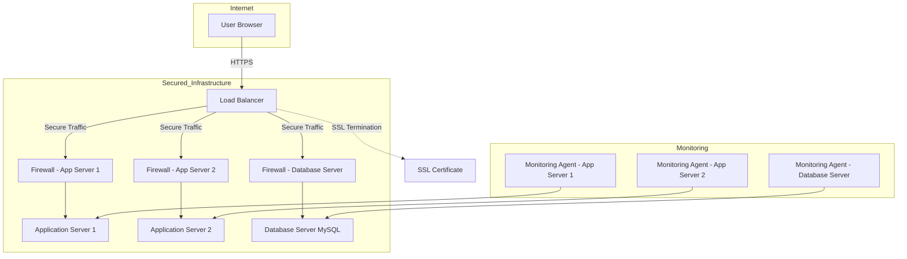

### Secured and Monitored Web Infrastructure for www.foobar.com

#### Infrastructure Overview
We are designing a secured and monitored web infrastructure for hosting the website www.foobar.com. This infrastructure will include security mechanisms (firewalls, HTTPS) and monitoring tools to ensure performance and reliability.

---

### Key Components and Their Roles

1. **Firewalls (3)**
   - **Purpose:** Protect the system by filtering unauthorized traffic.
   - **Placement:**
     - Between the internet and the load balancer.
     - Between the load balancer and the web/application servers.
     - Between the application servers and the database.
   - **Function:**
     - Inspect incoming and outgoing traffic.
     - Block unauthorized access and potential attacks.

2. **SSL Certificate**
   - **Purpose:** Serve traffic over HTTPS for secure communication.
   - **Function:**
     - Encrypts data between the client and server, ensuring confidentiality.
     - Validates the server’s identity to protect against man-in-the-middle attacks.

3. **Monitoring Clients (3)**
   - **Purpose:** Monitor the health and performance of the infrastructure.
   - **Placement:**
     - On the load balancer.
     - On the web/application servers.
     - On the database server.
   - **Function:**
     - Collect metrics such as CPU usage, memory usage, disk I/O, and QPS (Queries Per Second).
     - Forward metrics to a centralized monitoring service like Sumologic.

---

### Benefits of Each Element

1. **Firewalls:**
   - Protect against malicious traffic.
   - Segment the infrastructure to contain potential breaches.

2. **SSL Certificate:**
   - Encrypts traffic, ensuring sensitive information is secure.
   - Builds trust with users by enabling HTTPS.

3. **Monitoring Clients:**
   - Provide visibility into system health and performance.
   - Enable proactive detection of failures or performance degradation.

---

### How Monitoring Works

1. **Data Collection:**
   - Monitoring clients collect metrics from each component (load balancer, web servers, database).
   - Metrics include:
     - CPU, memory, disk usage.
     - Network traffic.
     - Web server QPS (Queries Per Second).

2. **Data Forwarding:**
   - Collected data is sent to a centralized monitoring service (e.g., Sumologic, Prometheus).

3. **Data Visualization:**
   - Metrics are displayed in dashboards for analysis.

4. **Alerting:**
   - Alerts are triggered based on predefined thresholds (e.g., high CPU usage or slow query performance).

---

### Key Issues with the Infrastructure

1. **SSL Termination at the Load Balancer Level:**
   - **Issue:** After SSL termination, traffic between the load balancer and web servers is unencrypted.
   - **Mitigation:** Use end-to-end encryption by enabling HTTPS on web servers.

2. **Single MySQL Write Server:**
   - **Issue:** The primary database node is a single point of failure for write operations.
   - **Mitigation:** Configure automated failover to a replica node in case the primary fails.

3. **Servers with All Components:**
   - **Issue:** Running all components (web server, application server, and database) on the same machine reduces scalability and increases risk.
   - **Mitigation:**
     - Separate web, application, and database layers to distribute load.
     - Use containerization (e.g., Docker) or virtualization to isolate services.

---

### Monitoring Web Server QPS

1. **Install Monitoring Client:**
   - Install a monitoring agent (e.g., Sumologic, Prometheus Node Exporter) on the web server.

2. **Configure Metrics Collection:**
   - Use tools like Nginx metrics exporter to collect QPS data.

3. **Forward Metrics:**
   - Send QPS metrics to a centralized monitoring system.

4. **Visualize and Alert:**
   - Create a dashboard to visualize QPS over time.
   - Configure alerts for high QPS to ensure the infrastructure can handle the load.

---

### Final Diagram of the Secured and Monitored Web Infrastructure

#### Components:
1. **Firewalls:** Protect traffic at each layer (internet, load balancer, database).
2. **SSL Certificate:** Enables secure HTTPS communication.
3. **Monitoring Clients:** Collect and forward metrics to monitoring services.
4. **Load Balancer (HAProxy):** Distributes traffic among web servers.
5. **Web Servers (Nginx):** Serve static files and forward dynamic requests.
6. **Application Servers:** Process dynamic requests.
7. **Database Cluster (MySQL):** Provides redundancy with primary and replica nodes.

---

### Repository
- **GitHub Repository:** `holbertonschool-system_engineering-devops`
- **Directory:** `web_infrastructure_design`
- **File:** `2-secured_and_monitored_web_infrastructure`

[task2](task2ds.mmd)

[task2](task2.mmd)

