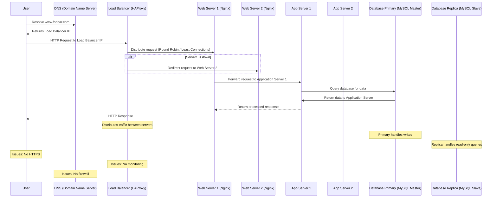

### Scaled-Up Web Infrastructure for www.foobar.com

#### Infrastructure Overview
To scale up the existing web infrastructure for www.foobar.com, we will introduce additional servers and split components into separate layers. This architecture ensures improved scalability, redundancy, and fault tolerance.

---

### Key Components Added

1. **Additional Load Balancer (HAProxy)**:
   - **Purpose:**
     - Configured as a cluster with the existing load balancer to eliminate the single point of failure.
     - Ensures traffic distribution remains operational even if one load balancer fails.
   - **Cluster Setup:**
     - Active-Active configuration where both load balancers distribute traffic simultaneously.

2. **Dedicated Web Server:**
   - **Purpose:**
     - Handles only static content (HTML, CSS, JavaScript) and serves client requests directly.
     - Reduces load on application servers by separating responsibilities.

3. **Dedicated Application Server:**
   - **Purpose:**
     - Processes dynamic content and executes application logic.
     - Interfaces with the database to retrieve or store data.
   - **Why Separate the Web and Application Layers?**
     - Improves resource utilization by isolating dynamic processing from static file serving.
     - Easier to scale application servers independently based on demand.

4. **Dedicated Database Server:**
   - **Purpose:**
     - Solely manages data storage and retrieval operations.
     - Improves performance by isolating database operations from application and web servers.

---

### Benefits of Each Component

1. **Clustered Load Balancer:**
   - Prevents downtime caused by load balancer failure.
   - Distributes traffic evenly across web servers, ensuring no server is overwhelmed.

2. **Web Server:**
   - Optimized for serving static files quickly.
   - Reduces the load on application servers by offloading static content delivery.

3. **Application Server:**
   - Handles complex application logic independently.
   - Scalable to meet demand without impacting the web or database layers.

4. **Database Server:**
   - Focused solely on data storage and retrieval, improving efficiency and performance.

---

### How the Infrastructure Works
1. **Client Request:**
   - A user accesses `www.foobar.com`.
   - The DNS resolves the domain to the load balancers' IP addresses.

2. **Traffic Distribution:**
   - The load balancers distribute requests to the appropriate web server using a Round Robin or Least Connections algorithm.

3. **Static vs. Dynamic Requests:**
   - **Static Content:** Web servers handle static content directly.
   - **Dynamic Requests:** Web servers forward dynamic requests to the application servers.

4. **Application Server Processing:**
   - Application servers process dynamic requests and query the database server for data.

5. **Database Operations:**
   - The database server retrieves or updates data and sends the response back to the application server.

6. **Response Delivery:**
   - The application server generates the final response and sends it to the web server, which delivers it to the client.

---

### Specifics of the Infrastructure

#### Why Add an Additional Load Balancer?
- Eliminates the single point of failure at the load balancer layer.
- Increases availability and redundancy through clustering.

#### Why Separate Components?
1. **Web Server:**
   - Optimized for static file delivery.
   - Reduces resource contention with application logic.

2. **Application Server:**
   - Can be scaled independently to handle dynamic content demand.
   - Reduces bottlenecks in processing logic.

3. **Database Server:**
   - Focuses solely on managing data storage and retrieval.
   - Prevents interference from application or web processes.

---

### Repository
- **GitHub Repository:** `holbertonschool-system_engineering-devops`
- **Directory:** `web_infrastructure_design`
- **File:** `3-scale_up`

[task3](task3dg.mmd)




[task3](task3.mmd)


```mermaid

graph TD
    %% User and Load Balancer
    User[User Browser] -->|HTTPS| LB1[Load Balancer 1]
    User -->|HTTPS| LB2[Load Balancer 2]

    %% Load Balancer Cluster
    LB1 -->|Active Traffic| WS1[Web Server]
    LB2 -->|Backup Traffic| WS1

    %% Web Server to Application Server
    WS1 -->|Forward Requests| AS1[Application Server]

    %% Application Server to Database
    AS1 -->|Queries| DB[Database (MySQL)]

    %% Monitoring Clients
    MC1[Monitoring Client - Web Server] -->|Monitors| WS1
    MC2[Monitoring Client - App Server] -->|Monitors| AS1
    MC3[Monitoring Client - Database] -->|Monitors| DB


```
